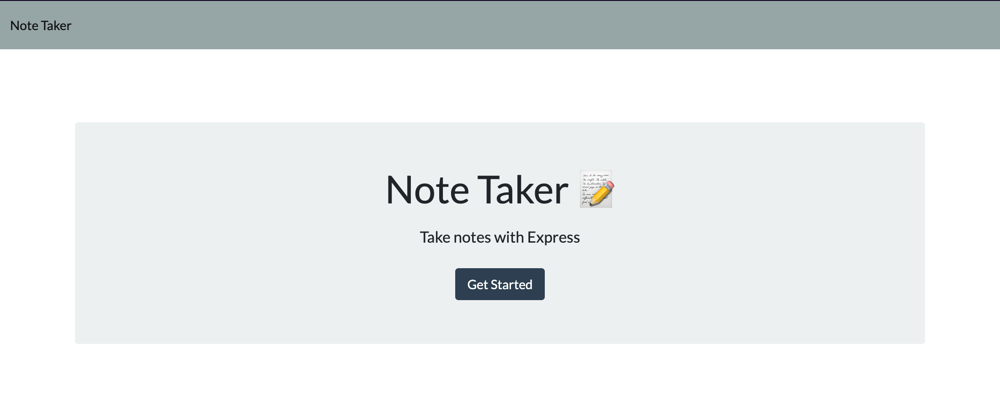
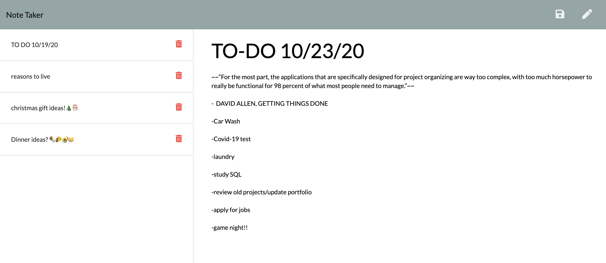

# Note-Taker

Here we have one of the **best** note taking applications on this side of the Mississippi.
This not taking app will allow you to store your notes even after closing out of the browser.

Set the application as a new tab default to provide quick access to all of your saved notes.

[ULTIMATE NOTE TAKER APP HERE ](https://ultimate-note-taker.herokuapp.com/)

^^^   ^^^   ^^^   ^^^   ^^^   ^^^   ^^^   ^^^

## Simple Interface

Modern and clean interface as shown below.

Click "Get Started" to open up the application!

Note taker is here to assist and ensure that all of your day to day tasks get **DONE**!

## Contributing

Pull requests are welcome. For major changes, please open an issue first to discuss what you would like to change.  

#### LINKS

    
[ ~Deployed App~ ](https://ultimate-note-taker.herokuapp.com/)

[ ~GitHub Repo~ ](https://github.com/Davidanderson76/Note-Taker)

[ ~GitHub Profile~ ](https://github.com/Davidanderson76)
